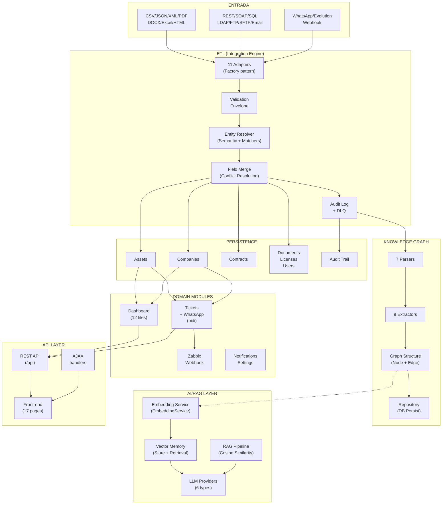
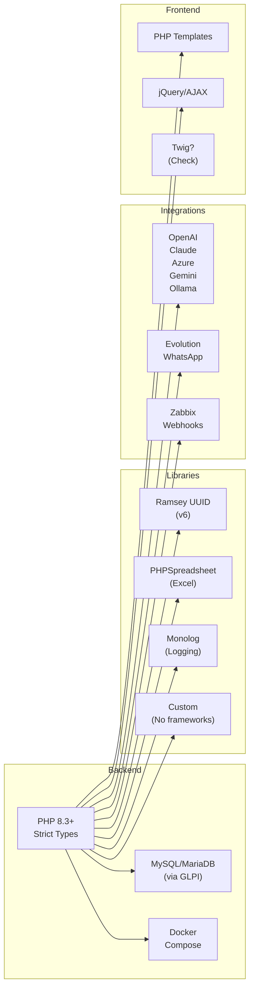
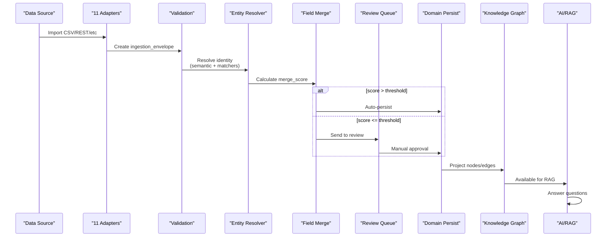
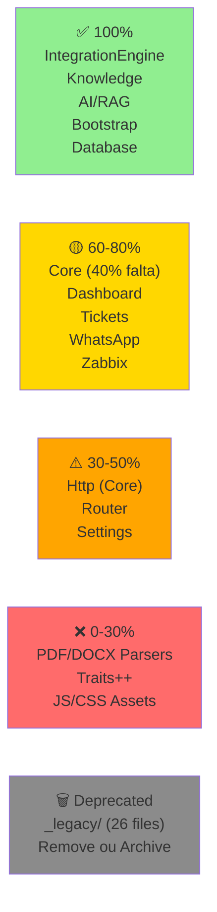

# 🗺️ MAPA MENTAL - ARQUITETURA SOLPI v2.0

## Diagrama Geral (Microserviços Lógicos)



---

## Stack de Tecnologia



---

## Fluxo de Dados (Detalhado)



---

## Dependências Entre Módulos

```mermaid
graph TB
    IntegrationEngine["IntegrationEngine<br/>(81 files)<br/>⭐ MOTOR"]
    Knowledge["Knowledge<br/>(67 files)<br/>📚"]
    AI["AI/RAG<br/>(31 files)<br/>🤖"]
    Core["Core<br/>(69 files)<br/>🏗️"]
    Dashboard["Dashboard<br/>(12 files)"]
    Tickets["Tickets<br/>(4)"]
    WhatsApp["WhatsApp<br/>(4)"]
    Zabbix["Zabbix<br/>(5)"]
    
    IntegrationEngine --> Core
    IntegrationEngine --> Knowledge
    IntegrationEngine --> Dashboard
    
    Knowledge --> AI
    Knowledge --> Core
    
    AI --> Core
    
    Dashboard --> Core
    Dashboard -.->|Bidi| Tickets
    Tickets -.-->|Bidi| WhatsApp
    
    Zabbix --> Core
    
    style IntegrationEngine fill:#f99
    style Knowledge fill:#99f
    style AI fill:#9f9
    style Core fill:#ff9
    style Dashboard fill:#f9f
```

---

## Status de Implementação (Heat Map)



---

## Recomendações de Cleanup

```mermaid
mindmap
  root((SOLPI<br/>v2.0))
    CRÍTICO
      Completar Core.php
        QueryBuilder::execute()
        Config validation
      Remove _legacy/
        26 arquivos deprecated
      Testes integrados
        Integration tests
        E2E tests
    IMPORTANTE
      Enriquecer generics
        Notifications domain
        Settings domain
      Traits extras
        Database trait
        Cache trait
        Validation trait
      Rate limiting
        WhatsApp adapter
    DESEJÁVEL
      JS/CSS Assets
        Minify
        Documentation
      Coverage > 50%
      API documentation
        OpenAPI/Swagger
```

