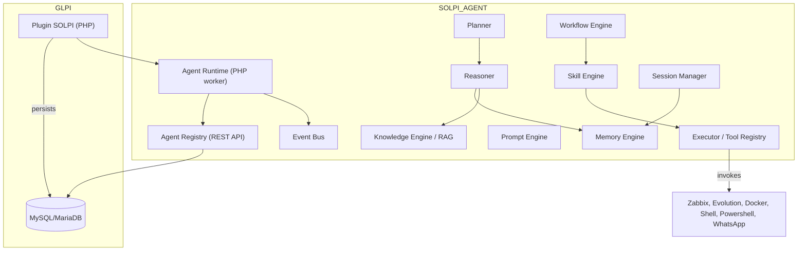

# SOLPI Agent — Arquitetura Proposta

Objetivo
- Evoluir o plugin SOLPI para uma Agent Platform especializada em ITSM, Observabilidade e Automação de Infraestrutura, preservando compatibilidade com GLPI, Zabbix, Evolution API, banco de dados, Docker e APIs existentes.

Restrições
- Não alterar tabelas core do GLPI.
- Não sobrescrever arquivos existentes; criar novos namespaces e módulos compatíveis.
- Não copiar código de OpenClaude, Hermes ou OpenClaw — usar apenas como referência arquitetural.

Visão Geral (alto nível)

Componentes e responsabilidades (namespace / arquivo sugerido)
- `Agent/Runtime` (AgentRuntime.php): loop do agente, discovery local, registro/heartbeat, execução de jobs agendados.
- `Agent/Registry` (Controller + Repository + Migration): endpoints REST para registro, heartbeat, inventário e listagem de instalações (`solpi_installations`).
- `Agent/Planner` (PlannerInterface, PlannerService): gera planos de alto nível a partir de solicitações (intents) e contexto.
- `Agent/Reasoner` (ReasonerInterface): valida planos, interage com LLM via `AI/` (PromptEngine) e aplica heurísticas / constraints.
- `Agent/Memory` (MemoryEngine, MemoryRepository): armazenamento persistente + vector store adapter para RAG; APIs: `get(contextKey)`, `append(trace)`, `search(query)`.
- `Agent/Knowledge` (KnowledgeEngine, Importers): indexação e busca semântica; pipelines ETL para dados do GLPI e documentos (importers já em `src/Knowledge`).
- `Agent/Workflow` (WorkflowEngine, WorkflowRepository): orquestra passos, retries, compensações e audit trails.
- `Agent/Skill` (SkillEngine, SkillRegistry): registro e execução de skills (procedimentos autorizados), com meta: idempotência e approval flows.
- `Agent/Prompt` (PromptEngine): templates, prompt tuning, prompt chaining; integra com `AI/Providers` existente.
- `Agent/Executor` (ExecutorEngine, ToolRegistry): adaptadores para executar comandos locais (shell, powershell), chamadas HTTP, chamadas Zabbix API e Evolution API; gerencia sandboxes (Docker) e aprovação.
- `Agent/Session` (SessionManager): gerencia sessões de conversação/execução, persiste transcrição e estado.
- `Core/EventBus` (EventDispatcher): pub/sub local para eventos (discovery, alert, execution_result), usado por integrations e UI.

Interfaces/Contratos (exemplos concisos)
- `PlannerInterface { createPlan(Request): Plan }`
- `ReasonerInterface { assessPlan(Plan): Decision }`
- `MemoryStoreInterface { upsert(doc), query(vector), get(id) }`
- `ExecutorInterface { execute(Action): Result }`
- `SkillInterface { run(params, Context): SkillResult }`

Modelos de Dados principais
- `solpi_installations` (migration descrita em `docs/SOLPI_AGENT_REGISTRY.md`)
- `agent_sessions` (id, installation_id, session_state (JSON), created_at, updated_at)
- `agent_plans` (id, session_id, plan_json, status, created_at, executed_at)
- `memory_entries` (id, session_id?, vector_json, content_hash, created_at)

Integrações e pontos de extensão
- GLPI: leitura/escrita via APIs internas já presentes; não mudar contratos públicos.
- Zabbix: usar `src/Integrations/Zabbix` e criar adaptador em `Agent/Executor/Adapters/ZabbixAdapter`.
- Evolution API: adaptador para chamadas seguras e registro de webhooks.
- Docker/PowerShell/SSH: `ExecutorEngine` provê adaptadores para isolar execução (usando containers ou sandboxes).
- External LLM Providers: reusar `src/AI/Providers` e adaptar para novos Engines via `PromptEngine`.
- MCP: manter capacidade mínima (agents) via `Agent/MCP` adapter; registrar um MCP catalog entry quando necessário.

Segurança e Governança
- Comunicação agente ↔ registry: HTTPS + HMAC signatures com token rotativo; armazenar apenas hash do token.
- Approval/Allowlist: skills que executam comandos sensíveis precisam passar por approval flows (manual ou regras automatizadas).
- Privacidade: inventário detalhado enviado apenas com consentimento (opt-in); mascaramento/redaction automático de campos sensíveis.

Deployment e operação
- Implantação recomendada: GLPI + SOLPI plugin em container (Docker Compose) — Agent Runtime roda como processo worker dentro do mesmo container ou em container sidecar.
- Escalabilidade: AgentRegistry deve suportar múltiplas instalações; usar paginação e rate-limiting para listagens e heartbeats.
- Logs e observabilidade: exportar métricas (Prometheus) e logs estruturados; exposição de health checks.

Impacto e compatibilidade
- Não alterar APIs GLPI: expor novas APIs sob `/plugins/solpi/agent/*`.
- Migrações DB: adicionar tabelas do plugin; incluir rollback.
- Performance: heartbeats leves por padrão; inventário completo enviado em janela restrita.

Roadmap (curto prazo)
1. Revisão do documento e política de aprovação (auto/manual).
2. Criar migração `solpi_installations` + modelos e repositório PHP.
3. Implementar endpoints de registro/heartbeat + testes de integração.
4. Implementar `Agent/Runtime` com discovery básico e registro automático.
5. Implementar `Agent/Executor` com adaptadores para Zabbix e Evolution API.
6. Implementar `MemoryEngine` + PoC de RAG local (vector store adapter opcional).
7. UI: dashboard de instalações e detalhe de inventário.

Notas finais
- Este documento é a base para começar a implementação modular. Não há código gerado aqui — próximas ações: aprovar o design e eu preparo os migrations e esqueletos (sem sobrescrever arquivos existentes).
